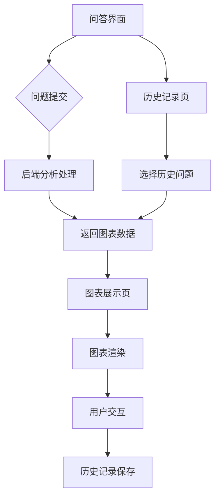

## 1. 产品概述
这是一个银行数据分析问答系统，允许用户通过自然语言提问获取数据分析结果，并以图表形式直观展示。系统面向银行数据分析部门，帮助快速获取业务数据洞察。

目标用户：银行数据分析人员、业务管理人员，通过自然语言查询快速获得数据图表分析结果。

## 2. 核心功能

### 2.1 用户角色
| 角色 | 注册方式 | 核心权限 |
|------|----------|----------|
| 数据分析员 | 邮箱注册 | 提交问题、查看图表、管理历史记录 |
| 业务管理员 | 管理员分配 | 查看所有分析结果、导出数据 |

### 2.2 功能模块
数据分析问答系统包含以下主要页面：
1. **问答界面**：问题输入、提交按钮、加载状态显示
2. **图表展示页**：多种图表类型展示、图表交互、数据详情
3. **历史记录页**：过往查询记录、结果重现、记录管理
4. **个人中心**：用户信息、设置选项

### 2.3 页面详情
| 页面名称 | 模块名称 | 功能描述 |
|----------|----------|----------|
| 问答界面 | 问题输入区 | 支持自然语言输入，提供问题示例和提示 |
| 问答界面 | 提交按钮 | 发送问题到后端分析，显示加载状态 |
| 问答界面 | 快速提问 | 预设常用问题模板，一键提问 |
| 图表展示页 | 图表区域 | 基于G2Plot渲染多种图表类型（柱状图、折线图、饼图等） |
| 图表展示页 | 图表控制 | 支持图表类型切换、数据筛选、导出功能 |
| 图表展示页 | 数据详情 | 显示具体数据表格，支持排序和搜索 |
| 历史记录页 | 查询历史 | 展示历史提问记录，支持搜索和筛选 |
| 历史记录页 | 结果重现 | 点击历史记录重新展示对应图表 |
| 历史记录页 | 记录管理 | 删除、收藏、标记重要记录 |
| 个人中心 | 用户信息 | 显示用户基本信息和权限 |
| 个人中心 | 设置选项 | 图表默认配置、主题设置、通知偏好 |

## 3. 核心流程

### 用户提问流程
1. 用户在问答界面输入自然语言问题
2. 系统验证问题格式和权限
3. 后端接收问题并进行数据分析处理
4. 返回分析结果和图表配置数据
5. 前端使用G2Plot渲染图表展示
6. 记录保存到用户历史

### 图表展示流程
1. 接收后端返回的图表数据
2. 根据数据类型自动选择合适图表
3. 渲染交互式图表（缩放、tooltip、图例等）
4. 提供图表导出和数据查看功能

## 4. 用户界面设计

### 4.1 设计样式
- **主色调**：深蓝色 (#1890ff) 体现专业性
- **辅助色**：浅灰色 (#f5f5f5) 用于背景
- **按钮样式**：圆角矩形，主要操作为实心蓝色
- **字体**：系统默认字体，标题16px，正文14px
- **布局**：卡片式布局，左右分栏设计
- **图标**：使用简洁的线性图标，符合企业应用风格

### 4.2 页面设计概述
| 页面名称 | 模块名称 | UI元素 |
|----------|----------|--------|
| 问答界面 | 输入区域 | 大文本输入框，高度自适应，边框蓝色高亮 |
| 问答界面 | 按钮组 | 蓝色提交按钮，灰色重置按钮，并排布局 |
| 问答界面 | 快速提问 | 标签式按钮组，显示预设问题分类 |
| 图表展示页 | 图表容器 | 白色背景，阴影边框，圆角设计 |
| 图表展示页 | 控制面板 | 顶部工具栏，包含图表类型切换和下拉菜单 |
| 图表展示页 | 数据表格 | 斑马纹表格，支持排序图标显示 |
| 历史记录页 | 记录列表 | 时间轴样式，显示问题摘要和创建时间 |
| 历史记录页 | 操作按钮 | 图标按钮组，包含查看、删除、收藏功能 |

### 4.3 响应式设计
- **桌面优先**：主要面向桌面端用户优化
- **移动端适配**：支持平板和手机访问
- **触摸优化**：按钮和交互元素适合触摸操作
- **自适应布局**：根据屏幕尺寸调整布局结构