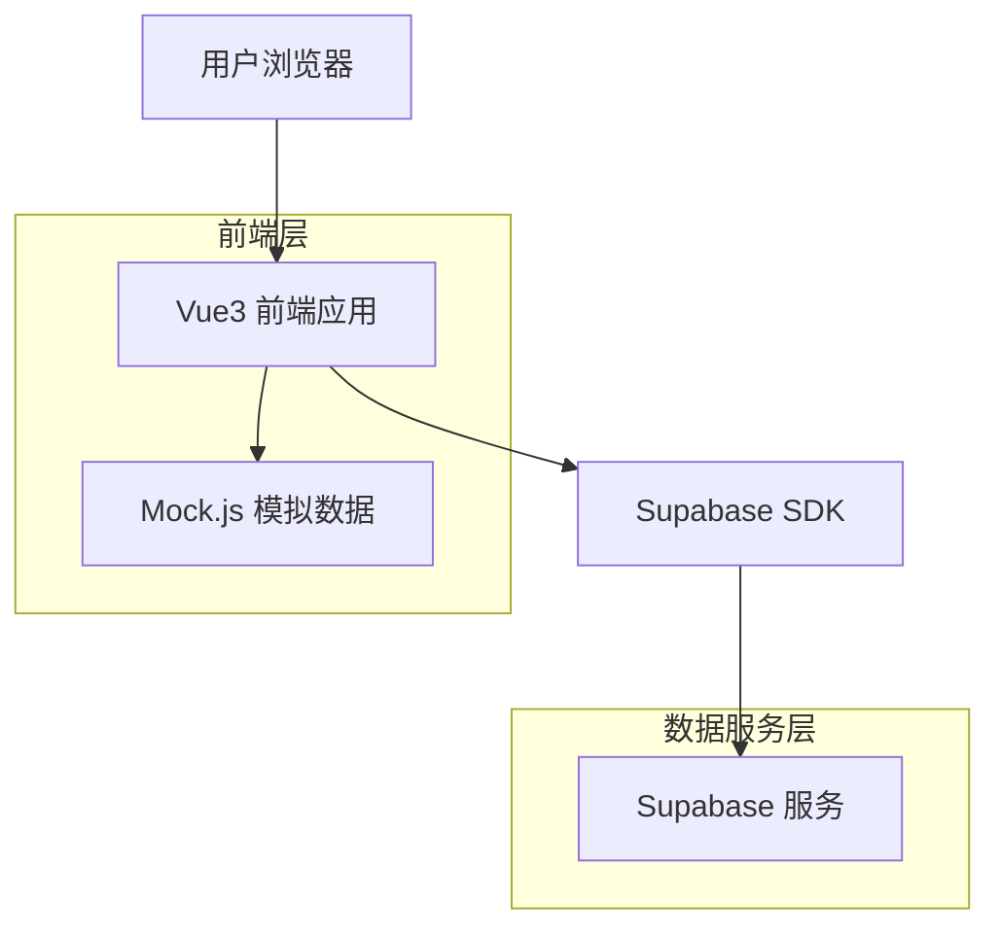
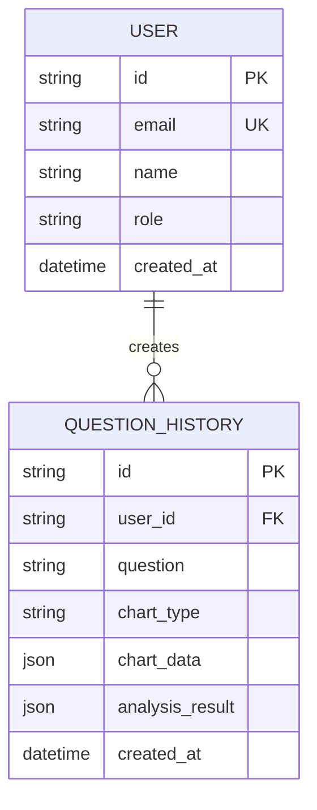

## 1. 架构设计



## 2. 技术描述

- **前端框架**: Vue3 + TypeScript + Vite
- **UI组件库**: Element Plus
- **图表库**: @antv/g2plot
- **模拟数据**: Mock.js
- **初始化工具**: vite-init
- **状态管理**: Pinia
- **路由**: Vue Router 4
- **后端服务**: Mock.js 模拟（后期可接入真实后端）

## 3. 路由定义

| 路由 | 用途 |
|------|------|
| / | 问答界面，主要功能页面 |
| /chart | 图表展示页面 |
| /history | 历史记录页面 |
| /profile | 个人中心页面 |
| /login | 登录页面 |
| /register | 注册页面 |

## 4. API 定义

### 4.1 核心 API

**问题分析接口**
```
POST /api/analyze
```

请求参数：
| 参数名 | 参数类型 | 是否必需 | 描述 |
|-----------|-------------|-------------|-------------|
| question | string | true | 用户输入的自然语言问题 |
| userId | string | true | 用户ID |

响应参数：
| 参数名 | 参数类型 | 描述 |
|-----------|-------------|-------------|
| status | boolean | 请求处理状态 |
| data | object | 分析结果数据 |
| chartType | string | 图表类型（bar/line/pie等） |
| chartData | array | 图表数据数组 |
| message | string | 处理结果描述 |

示例：
```json
{
  "question": "昨天广东省农业银行分行房贷申请人数同比增长多少？",
  "userId": "user123"
}
```

**历史记录接口**
```
GET /api/history
```

请求参数：
| 参数名 | 参数类型 | 是否必需 | 描述 |
|-----------|-------------|-------------|-------------|
| userId | string | true | 用户ID |
| page | number | false | 页码，默认1 |
| limit | number | false | 每页条数，默认10 |

## 5. 数据模型

### 5.1 数据模型定义



### 5.2 数据定义语言

**用户表 (users)**
```sql
-- 创建用户表
CREATE TABLE users (
    id UUID PRIMARY KEY DEFAULT gen_random_uuid(),
    email VARCHAR(255) UNIQUE NOT NULL,
    password_hash VARCHAR(255) NOT NULL,
    name VARCHAR(100) NOT NULL,
    role VARCHAR(20) DEFAULT 'analyst' CHECK (role IN ('analyst', 'admin')),
    created_at TIMESTAMP WITH TIME ZONE DEFAULT NOW()
);

-- 创建索引
CREATE INDEX idx_users_email ON users(email);
```

**历史记录表 (question_history)**
```sql
-- 创建历史记录表
CREATE TABLE question_history (
    id UUID PRIMARY KEY DEFAULT gen_random_uuid(),
    user_id UUID NOT NULL,
    question TEXT NOT NULL,
    chart_type VARCHAR(50),
    chart_data JSONB,
    analysis_result JSONB,
    created_at TIMESTAMP WITH TIME ZONE DEFAULT NOW(),
    FOREIGN KEY (user_id) REFERENCES users(id)
);

-- 创建索引
CREATE INDEX idx_question_history_user_id ON question_history(user_id);
CREATE INDEX idx_question_history_created_at ON question_history(created_at DESC);

-- 权限设置
GRANT SELECT ON question_history TO anon;
GRANT ALL PRIVILEGES ON question_history TO authenticated;
```

## 6. Mock数据设计

### 6.1 模拟问题分析数据
```javascript
// 房贷数据分析示例
const mockMortgageData = {
  chartType: 'line',
  chartData: [
    { month: '1月', thisYear: 1200, lastYear: 1000, growth: 20 },
    { month: '2月', thisYear: 1350, lastYear: 1100, growth: 22.7 },
    { month: '3月', thisYear: 1180, lastYear: 1050, growth: 12.4 },
    // ... 更多数据
  ],
  analysis: {
    totalGrowth: 18.5,
    peakMonth: '8月',
    trend: '上升'
  }
}

// 银行分行数据对比
const mockBranchData = {
  chartType: 'bar',
  chartData: [
    { branch: '广州分行', applications: 2500, approved: 2200 },
    { branch: '深圳分行', applications: 3200, approved: 2800 },
    { branch: '东莞分行', applications: 1800, approved: 1600 },
    // ... 更多分行数据
  ]
}
```

### 6.2 模拟响应格式
```javascript
// 成功响应
{
  status: true,
  data: {
    question: "昨天广东省农业银行分行房贷申请人数同比增长多少？",
    answer: "根据数据分析，昨天广东省农业银行分行房贷申请人数较去年同比增长23.5%",
    chartType: "line",
    chartData: [...],
    analysis: {...},
    generatedAt: "2024-01-15T10:30:00Z"
  },
  message: "分析完成"
}

// 错误响应
{
  status: false,
  data: null,
  message: "无法理解问题，请重新表述"
}
```